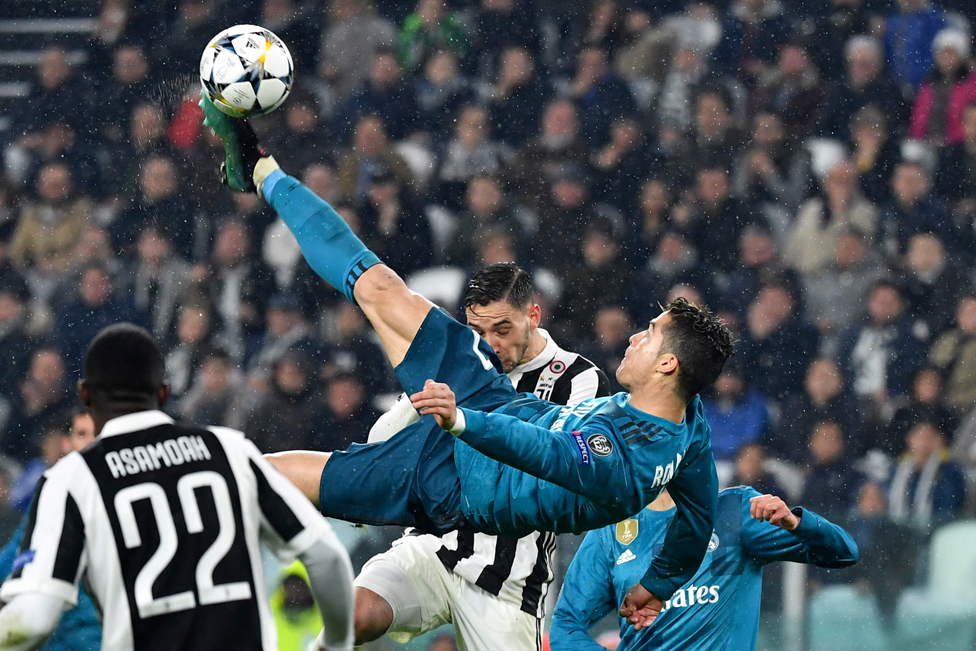

[← Volver al inicio](README.md)
# Temas del curso

### 18/09 . Mis aficiones.
Llevo jugando al fútbol desde los 4 años, en diferentes equipos.
Lo que más me gusta es la sensación de ganar un partido contra un rival que era difícil.
Entreno los lunes, miércoles y viernes y juego los sábados o domingos.
Mi jugador de fútbol favorito es Cristiano Ronaldo
También me gusta salir con mis amigos a la calle los sábados o los domingos.



Las propone el profesor a lo largo del curso. **La más reciente, arriba.** Diez líneas de máximo.

```
### Título del tema — fecha

**De dónde sale:** el artículo, vídeo o noticia (pon el enlace).
**La frase que me chocó:** cópiala tal cual, entre comillas.
**Por qué me chocó a mí:** aquí es donde escribes tú.
**Qué tiene que ver con clase:** con qué actividad o tema lo relacionas.
```
