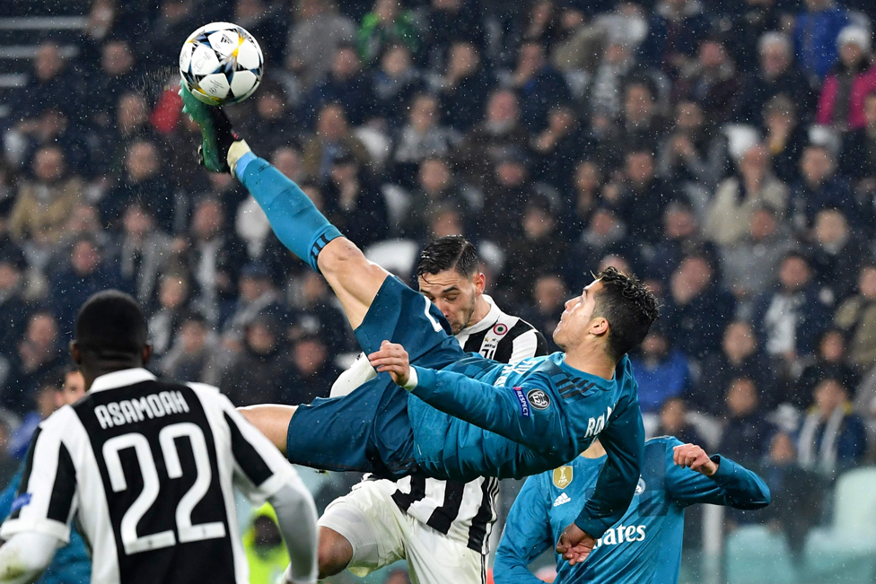
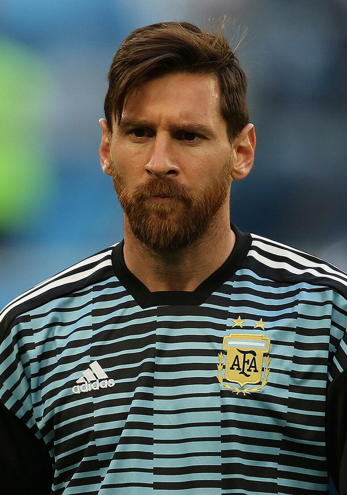

[← Volver al inicio](README.md)
# Temas del curso

### 18/09 . Mis aficiones.
Llevo jugando al fútbol desde los 4 años, en diferentes equipos.
Lo que más me gusta es la sensación de ganar un partido contra un rival que era difícil.
Entreno los lunes, miércoles y viernes y juego los sábados o domingos.
Mi jugador de fútbol favorito es Cristiano Ronaldo
También me gusta salir con mis amigos a la calle los sábados o los domingos.

[Fútbol Data](https://github.com/hudl/open-data)

### 29/09 . Premios princesa de Asturias 
El jugador de fútbol Lionel Messi ha sido premiado a ganar el premio princesa de asturias de los deportes 2026 por las siguientes razones: 
El jurado opina que ha tenido una gran influencia en la labor solidaria, además de su gran carrera a nivel colectivo e indiviudal.
Aparte de todo eso han decidido darle el premio por que es el jugador con más títulos de la historia.
A mi me gustaría que lo ganara ya que me parece que se lo merece mucho.

[Messi Premios Princesa de Asturias](https://www.fpa.es/es/premios-princesa-de-asturias/premiados/2026-leo-messi/)

